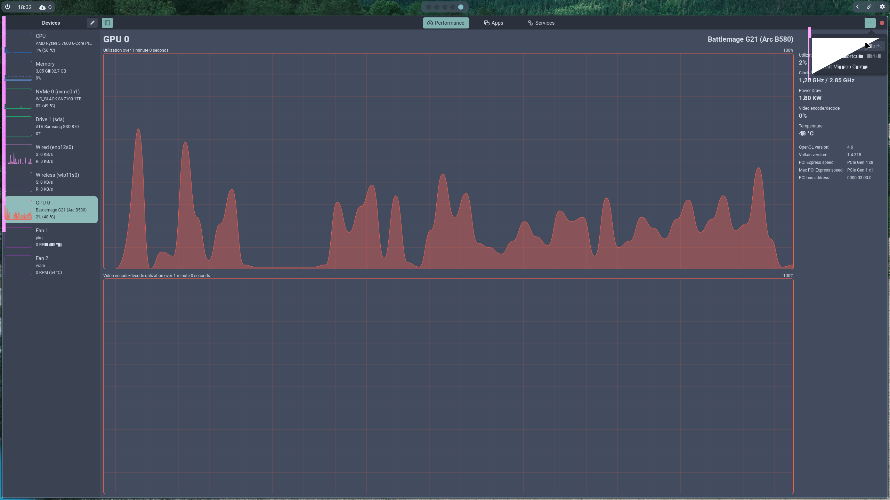

My computer suddenly broke down a few weeks ago. Even though it was six years old, this was quite unexpected and kind of annoying. The main problem was that my computer would turn on, the RGB on the motherboard would glow, but I wouldn't get any display output. Simple problem, the GPU died. I ordered a new GPU (an Intel Arc B580 I was eyeing already) and waited till the next day for it to arrive.

The next day, I installed the new GPU, booted the computer up and... Still nothing. Seems like it isn't a GPU issue. I tried swapping PCIe slots, but nothing worked. I dreaded this already, as I do _have_ an extra AM4 CPU, but it was installed in my NAS. This would mean, turning off my NAS, pulling out the chip, reinstalling it in my main rig and have my NAS not functional during that time. This would really suck, but because I was out of options, I took out the CPU, installed it and the display turned on. Nothing else seemed broken and my boot drive was also working. This meant that the CPU was (probably) dead.

## Fixing or rebuilding

Well, this caused me to debate just swapping out the old AM4 CPU, which would cost me about €50, and have me up and running. But I was already planning on building a new computer, which would be a small form factor computer and just fit the aestethic of my room a bit better. This would set me back about €750 extra on top of the €270 I already paid for my new GPU. Because the AM4 platform is practically dead and I wanted to have the new AM5 platform in my new computer, I decided to bite the bullet and go for it.

Another day later and my new computer arrived. After building it (the [Fractal Design Ridge](https://www.fractal-design.com/products/cases/ridge/) looks awesome) I also decided to change out my old Pop_OS! install for a fresh Arch Linux install with my own [dotfiles](https://github.com/legoraft/dots). Mostly because my old install was a total mess and I was due for a cleanup a long time ago. I also wanted to change from pop's default stacking layout to a tiling, workspace based workflow, which I've used on my macbook for the past year.

## A fresh install

I love the setup I have using my dotfiles and I am currently using Hyprland as my wayland compositor. I've tuned my dotfiles on an old laptop already, but they are now used in a true 'production' environment and they work great! Previously, I was using Pop_OS!, which was a mess due to me trying out a lot of things and never cleaning up. My computer breaking finally pushed me to fix some stuff on my computer and I now have a great computer and some great software to go with it!

I've already tried some gaming on it, as I'm currently doing my first full playthrough of GTA V. Because this game still is quite demanding (especially on the enhanced edition) I was happy to see that I could bump up to the highest graphics settings (no RT[^1]) and have a stable framerate (60+). I also booted up Minecraft, which just ran great, which it also did on my old computer.

## Being an early adopter

However great my new computer is, having an Intel GPU means being an early adopter. This often comes with some issues. I'm also using Wayland, which could also be viewed as being on the bleeding edge. Wayland isn't fully matured yet, but most problems with wayland have been solved nowadays (see [wearewaylandnow](https://wearewaylandnow.com)). The Intel Arc GPU also has been around for a few years and I didn't have any issues until I downloaded a libadwaita application. I downloaded [mission center](https://missioncenter.io/) as a graphical system status viewer, and wanted to use it to monitor GPU usage during gaming. After starting mission center, I slowly saw some weird graphical errors appearing and after a little while the full application would glitch out and hang.

After doing some research, I found out that by setting `GSK_RENDERER=gl` before launching mission center it would be fixed. These issues also appear in other libadwaita applications and have the same fix. This seemed to be related to mesa or the intel xe driver. I found a few bug reports like [mesa's #13759](https://gitlab.freedesktop.org/mesa/mesa/-/issues/13759) and [nixpkgs' #353990](https://github.com/NixOS/nixpkgs/issues/353990). The root cause for these problems hasn't really been found yet, but I'm hopeful that they will be fixed eventually. This is just a fact of using hardware and software that isn't widely used yet.

## Conclusion

It sucks a lot if anything you care about breaks down. With a computer though, you often don't know what the exact cause is. If you're lucky, you have a homelab you can borrow parts from, which allows you to check more variables than someone who doesn't have any hardware around. Debugging hardware is very difficult. A lot of variables can cause problems and you're not always 100% sure about the issue.

I would always recommend getting a CPU with integrated graphics if you're building a computer (I did with my new one). This enables you to do some rudimentary debugging without needing extra hardware. I'm also very happy that I was able to buy a new computer (definitely in this economy), but being on the bleeding edge of tech is a bit of a hit or miss. I think that having an Intel GPU definitely isn't the bleeding edge anymore, as they have been released for about 2 years now, but this doesn't mean that all issues have been ironed out or it is mainstream (thinking of you, wayland[^2]). When buying something that is quite new, you always have the risk of running into weird unknown issues.

All in all, tech is a wonderful hobby and if you ever need to clean out computer, you can just push it off until said computer dies. More seriously, if you can improve your workflow in some way or another, please try to do it. I've refitted some of my workflow with my new software setup and I've been quite a bit more productive on my computer. I'm currently also trying out a new blogging workflow, which (hopefully) will improve the post volume over here, so I look forward to explaining that one in a future post once it has been ironed out.

[^1]: Ray tracing, a math-based way to calculate lighting. Turning this on instantly crashed my game.

[^2]: [Wayland](https://wayland.freedesktop.org/) is aiming to be an [xorg](https://www.x.org/wiki/) replacement, which has been getting more traction recently, even though it has existed for about 16 years.
