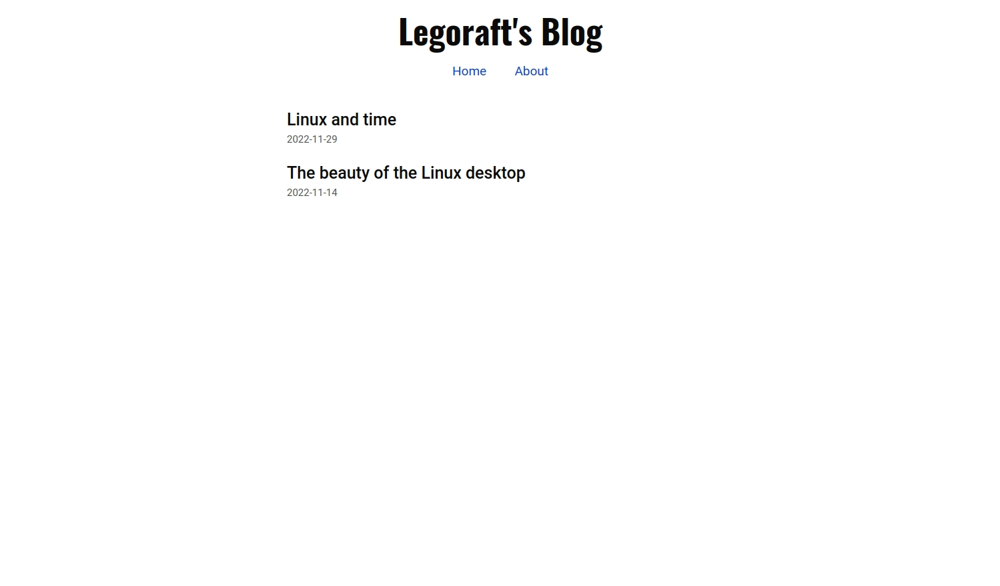
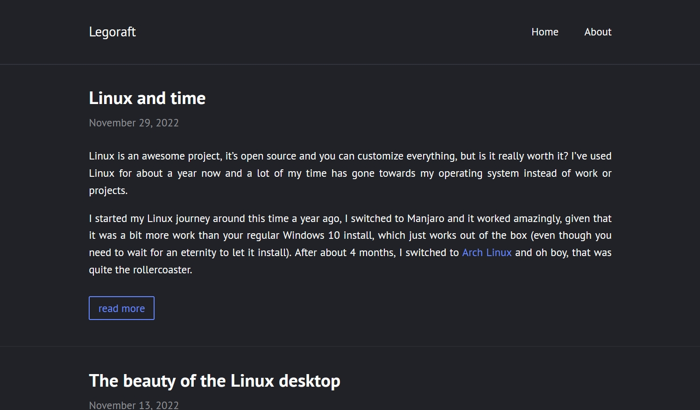
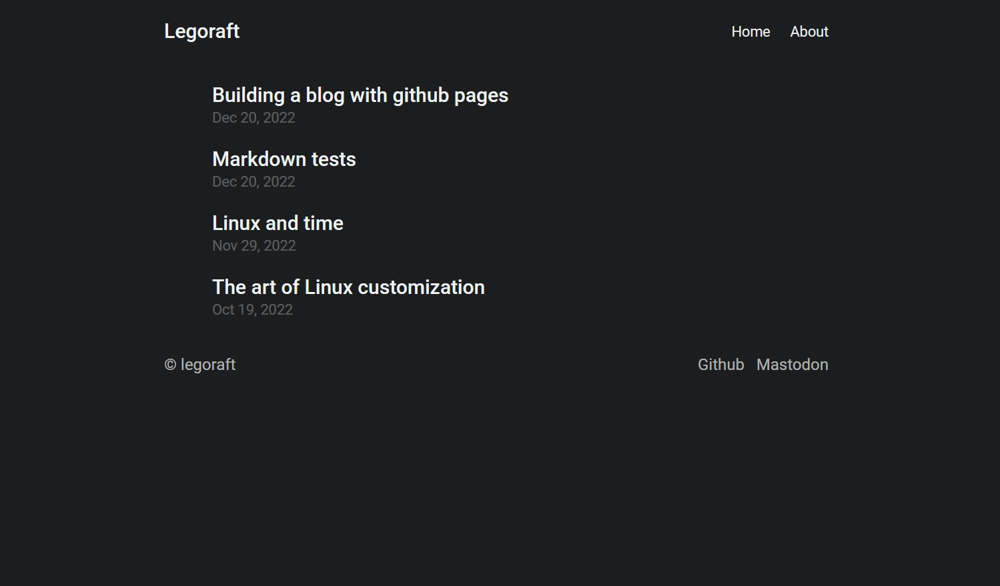

This blog has recently been on quite an adventure, as you can see from the 40+ commits in this site's [repository](https://github.com/legoraft/legoraft.github.io) in the past two weeks. I've been hopping from writing the full blog in raw HTML to using [Jekyll](https://jekyllrb.com/) to using the final site generator/framework I'm using now: [Hugo](https://gohugo.io/). I'll tell you about the journey I went on and why I finally chose for the Hugo framework.

## The start
My blog started when I found this neat little markdown editor called [Abricotine](https://abricotine.brrd.fr/), in fact I'm using it to write this blog post. The editor has this feature where you can export your markdown files to HTML using [pandoc](https://pandoc.org/). The generated site looked quite neat, so I started building a blog around it. As I've already had some experience writing HTML and CSS, making a small homepage, about page and the links to my blog posts wasn't that difficult, the only problem was that it was hardcoded so every time I made a post, the homepage needed to get updated.

The final result looked quite nice, as you can see above, but the constant updating annoyed me and it also took a huge amount of time to edit the pandoc files for every post I made.

Realising this approach wasn't the best, I looked around at other ways to achieve this blog. I did some of the react-js [blog tutorials](https://nextjs.org/learn/basics/create-nextjs-app), from which I actually have the link theming I use all over the blog, but I didn't like that I had to use vercel and github to make this blog and that I had this weird looking link instead of the link you're visiting now: [legoraft.github.io](https://legoraft.github.io). So I went on looking for a way to integrate this blog with github pages.

## Jekyll
When you search for 'blog github pages', you'll probably get some result linking to [Jekyll](https://jekyllrb.com/). It's a static site generator which let's you take markdown files and publish them as a fully-fledged html page. This looked amazing, so I jumped right in, but after trying to get it to work locally, it failed. It seems like these sites need a theme, so I went back to searching for Jekyll themes, which brought me to [jekyllthemes.io](https://jekyllthemes.io/). The themes on there look quite amazing, but the blog templates are a bit too flashy for my liking. I didn't want every post to have a huge image at the top, I want people to read my posts. Besides, most of the themes where quite expensive for someone who just wants to have a place to complain about how difficult it is to build a blog.

I wanted to make my own Jekyll theme, because I can design a simple blog as a developer, I just need to know some HTML and CSS. Well, it wasn't that easy, so I tried finding the next best thing for free on the Jekyll theme site, so I landed on [contrast](https://jekyllthemes.io/theme/contrast), which seemed like a light theme at first, but after visiting a demo, was a dark theme. No worries, we love dark themes, but there were some annoying borders on the top and sides of the pages, which I didn't like.

I didn't let myself get knocked out by this, so I dove into the css to make the borders dissappear, but that didn't work. So I went looking for a new framework which would let me design my own theme and be simple to use and edit.

## Hugo
I found Hugo through Chris Titus's [site](https://christitus.com), because it uses this framework. So I got to looking up everything there is to find on Hugo of course.

Hugo is advertised as the fastest framework on the internet, which I personally don't really care about, but it's nice. The thing I did care about was that there was a very straightforward [tutorial](https://draft.dev/learn/creating-hugo-themes) on making themes for Hugo. I followed this tutorial and looked a bit at the source code for a theme called [Holy](https://github.com/serkodev/holy), which ended up in me making the site theme your reading this on now (although I can't guarantee I won't change it in the future). I loved Hugo mostly because of it's simplicity and good documentation (although I didn't dive very deep into the Jekyll documentation because I found it to be unclear).

As you can see, the theme hasn't changed a lot in design compared to the first one, but it has one major difference in the back-end: I don't need to edit huge HTML files to achieve blog posts like you're reading now.

## Final words
As always, I need to have some end-of-post commentary. I have to say, I love the structure Hugo uses and I love the fact that it uses a next-js like way of making your site. I hope this is the framework I'm going to stick with, because switching frameworks is hell. For further information, I'm planning to make a post about building a site with a theme with Hugo and Github pages, but that needs to wait until after Christmas.
